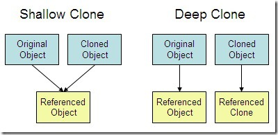

参考：https://github.com/Snailclimb/JavaGuide

## 基本概念

1、**JVM**：Java虚拟机，用于运行Java字节码，其针对不同的操作系统有着特定的实现，使得相同的字节码运行会给出相同的结果。

在Java中，JVM能够理解的代码就叫做**字节码**（.class文件）。其不面向任何特定的处理器，只面向虚拟机。

2、**JDK（Java Development Kit）**，即Java Development Kit，是功能齐全的Java软件开发包，拥有JRE所拥有的一切，有编译器（javac）和一些其他工具，能够创建和编译程序。

3、**JRE（Java Runtime Environment）**，即Java运行时环境。其为运行已编译Java程序所需要的所有内容的集合，包括Java虚拟机、Java类库、Java命令和其他一些基础的构建。但是，其不能用于创建新程序。

**编译与解释并存**：Java程序要经过先编译、后解释两个步骤。（先经过编译生成字节码文件*.class，再经过解释进行执行）

### 命令行编译

```
javac Test.java
java Test
```

`javac`程序是一个Java编译器，将`*.java`编译成`*.class`（需要`.java`后缀）

`java`程序启动Java虚拟机（只需要指定类名）


## 基本数据类型

Java有8中基本数据类型，数字类型（byte<1>、short<2>、int<4>、long<8>、float<4>、double<8>）；字符类型（char<2>）；布尔型（boolean<依赖于JVM的具体实现>），其中<>内为其所对应的字节数，每个基本数据类型又有对应的默认值。

### 装箱与拆箱

参考：https://www.cnblogs.com/dolphin0520/p/3780005.html

Java为每种基本数据类型都提供了对应的包装器类型，将基本数据类型转换成包装类称为**装箱**，反之则称为**拆箱**。

1、装箱：其中第一种方法不会触发自动装箱的机制，在执行效率和资源占用上，第二种方法通常要优于第一种情况。

```
Integer i = new Integer(10);	// 手动装箱
Integer i = 10;	// 自动装箱
```

拆箱（直接进行赋值语句即可）：

```
int i2 = i;
```

**装箱过程是通过调用包装器的valueOf方法实现的，而拆箱过程是通过调用包装器的 xxxValue方法实现的。（xxx代表对应的基本数据类型）。**

***

**注意：**

如下代码的输出不同，原因在于valueOf的实现方法，*可以简单总结为若数值在[-128,127]之间，便返回IntegerCache.cache中已存在的对象的引用，否则创建一个新的Integer对象*

```
Integer i1 = 100;
Integer i2 = 100;

Integer i3 = 200;
Integer i4 = 200;

System.out.println(i1==i2);
System.out.println(i3==i4);

####################################
true
false
```

同时，Integer、Short、Byte、Character、Long这几个类的valueOf方法的实现是类似的（**这些方法实现了常量池技术**），而Double、Float的valueOf方法的实现是类似的（**这些方法没有使用常量池技术**）。因此，上述代码若换成Double，会输出“false false”，换成Boolean会输出“true true”。

除此之外，还应该注意的是，如果这些包装类使用了算数运算符，那么“==”比较的将会是数值（即触发了自动拆箱），如下：

```
Integer a = 1;
Integer b = 2;
Integer c = 3;
System.out.println(c==(a+b));

#########################################
true
```

***

对于包装器类型，equals方法并不会进行类型转换，如下：

```
Integer a = 1;
Integer b = 2;

Long c = 3L;
Long d = 2L;

System.out.println(c==a+b);
System.out.println(c.equals(a+b));
System.out.println(c.equals(a+d));

###########################################
true
false
true
```


## 方法（函数）

#### 参数

**1、一个方法不能修改一个基本数据类型的参数**

示例：

```
public static void main(String[] args) {
    int num1 = 10;
    int num2 = 20;

    swap(num1, num2);

    System.out.println("num1 = " + num1);
    System.out.println("num2 = " + num2);
}

public static void swap(int a, int b) {
    int temp = a;
    a = b;
    b = temp;

    System.out.println("a = " + a);
    System.out.println("b = " + b);
}
```

结果：

```
a = 20
b = 10
num1 = 10
num2 = 20
```

说明：

在 swap 方法中，a、b 的值进行交换，并不会影响到 num1、num2。因为，a、b 中的值，只是从 num1、num2 的复制过来的（**值传递**）。也就是说，a、b 相当于 num1、num2 的副本，副本的内容无论怎么修改，都不会影响到原件本身。

**2、一个方法可以改变一个对象参数的状态**

示例：

```
public static void main(String[] args) {
	int[] arr = { 1, 2, 3, 4, 5 };
	System.out.println(arr[0]);
	change(arr);
	System.out.println(arr[0]);
}

public static void change(int[] array) {
	// 将数组的第一个元素变为0
	array[0] = 0;
}
```

结果：

```
1
0
```

说明：

array 被初始化 arr 的拷贝也就是一个对象的引用，也就是说 array 和 arr 指向的是同一个数组对象。 因此，外部对引用对象的改变会反映到所对应的对象上（类似于C++ 的引用传递）。


**3、一个方法不能让对象参数引用一个新的对象**

示例：

```
public class Test {

	public static void main(String[] args) {
		// TODO Auto-generated method stub
		Student s1 = new Student("小张");
		Student s2 = new Student("小李");
		Test.swap(s1, s2);
		System.out.println("s1:" + s1.getName());
		System.out.println("s2:" + s2.getName());
	}

	public static void swap(Student x, Student y) {
		Student temp = x;
		x = y;
		y = temp;
		System.out.println("x:" + x.getName());
		System.out.println("y:" + y.getName());
	}
}
```

结果：

```
x:小李
y:小张
s1:小张
s2:小李
```

说明：

方法并没有改变存储在变量 s1 和 s2 中的对象引用。swap 方法的参数 x 和 y 被初始化为两个对象引用的拷贝，这个方法交换的是这两个拷贝


#### 深拷贝、浅拷贝

1、**浅拷贝**：对基本数据类型进行值传递，对引用数据类型进行引用传递般的拷贝，此为浅拷贝。

2、**深拷贝**：对基本数据类型进行值传递，对引用数据类型，创建一个新的对象，并复制其内容，此为深拷贝。




### 方法重载（Overload）

同样的方法根据输入数据的不同，做出不同处理（同一个类中多个同名方法根据不同的传参来执行不同的逻辑处理）。满足如下要求：

a、同一个类中

b、方法名相同，参数列表不同，方法返回值相同

c、访问修饰符。


### 方法重写（Override）

重写发生在**运行期**，是子类对父类的允许访问的方法的实现过程进行重新编写（重写就是**子类对父类方法的重新改造**，外部样子不能改变，内部逻辑可以改变）。满足以下条件：

1、发生有继承关系的子类中，且父类方法的**访问修饰符为private/final/static则表示该方法不能重写**，但是使用static修饰的方法能够被再次声明。同时构造方法不能被重写。

2、子类方法的**访问权限必须大于等于**父类方法；

3、子类方法的返回类型必须是父类方法返回类型或为其子类型。

4、子类方法抛出的异常类型必须是父类抛出异常类型或为其子类型。

```
class SuperClass {
    protected List<Integer> func() throws Throwable {
        return new ArrayList<>();
    }
}

class SubClass extends SuperClass {
    @Override
    public ArrayList<Integer> func() throws Exception {
        return new ArrayList<>();
    }
}
```

如上代码段，子类的访问权限public>父类访问权限protected；子类返回值是父类接口的一个类实现（父类的子类型）；子类抛出的异常为父类抛出异常的子类。

*注：使用 @Override 注解，可以让编译器帮忙检查是否满足上面的限制条件*


## 关键字

### 1、final

**a. 数据**

声明数据为常量，可以是编译时常量，也可以是在运行时被初始化后不能被改变的常量。

- 对于基本类型，final 使数值不变；
- 对于引用类型，final 使引用不变，也就不能引用其它对象，但是被引用的对象本身是可以修改的。

**b. 方法**

声明方法不能被子类重写。

其中，**private方法隐式的被指定为final**。如果在子类中定义的方法和父类中的一个private方法相同，则视为子类中定义了一个新方法。

**c. 类**

声明类不能被继承


### 4、static

**a. 静态变量**

又称为类变量，类所有的实例都共享静态变量，可以直接通过类名来访问它。静态变量在内存中只存在一份。

```
public class A() {
	private static int x;	// 静态变量
}
```

**b. 静态方法**（main方法就是）

静态方法在类加载的时候就存在了，它**不依赖于任何实例**。所以静态方法**必须有实现**，也就是说它不能是抽象方法。

同时，静态方法只能访问所属类的静态字段和静态方法。

**方法中不能有this和super关键字**（这两个关键字与具体对象关联，而静态方法是不依赖于实例的）

**c.静态语句块**

静态语句块在**类初始化**时运行一次（注意不是实例化运行）

```
public class test {
    static {
        System.out.println("gg");
    }

    public static void main(String[] args) {
    }
}
///////////////////////////////////////////
gg
```

**4. 静态内部类**

非静态内部类依赖于外部类的实例，也就是说需要先创建外部类实例，才能用这个实例去创建非静态内部类。而静态内部类不需要。静态内部类不能访问外部类的非静态的变量和方法。


构造函数需要一个有参构造和一个无参构造


getter/setter


包：一个JAVA源文件中只能有一个package语句

命名方法：域名倒序+模块+功能


 

共有：public：任意位置

私有：private：本类中访问

保护：protected：当前类、同包子类/非子类、跨包子类（跨包子类不允许）

默认：当前类、同包子类（跨包子类不允许调用）


super：父类对象的引用

super.print() 访问父类成员方法

super.name 访问父类属性

super() 访问父类构造方法，必须位于子类构造方法的第一行


子类的构造过程必须调用其父类的构造方法，若子类构造方法中没有显式标注，则系统默认调用父类无参构造方法（若子类构造方法无显式标值且父类中没有无参构造方法，则编译出错）


多态：不同类的对象对同一消息做出不同响应

编译时多态：（方法重载）

运行时多态：程序运行时动态决定调用哪个方法


多态必要条件

1、满足继承关系

2、父类引用指向子类对象


向上转型，父类引用指向子类实例。可以调用子类重现父类的方法以及父类派生的方法，无法调用子类独有的方法

Animal two = new Cat()


向下转型，子类引用指向父类实例，此处要求必须进行强转

instanceof 运算符，返回 true false

```
if(obj instanceof Cat) {
	Cat temp = (Cat)obj
}
```


```
if() {
	return new Dog();
} else {
	return new Cat();
}
```


abstract关键字

抽象类，无法进行实例化的类（可以通过向上转型指向子类实例 ）

抽象方法：子类必须进行实现（或者子类也设置为抽象类），在父类定义时不能有方法体


包含抽象方法的类是抽象类

抽象类中可以没有抽象方法

static/final/private不能与abstract共存


接口：命名通常以“I”打头

接口定义了某一批类所需要遵守的规范

接口不关心这些类的内部数据，也不关心类中方法的实现细节，只规定这些类中必须提供某些方法


接口访问修饰符：public 默认

接口中抽象方法可以不写abstract关键字

作为接口的实现类必须实现接口中定义的所有方法，否则需要将该类设置为抽象类

接口中可以包含常量，默认public static final

```
public interface ITest {
    public void func();
}
```


```
public class A implements ITest {

    @java.lang.Override
    public void func() {

    }
}
```


```
INet net = new A();

```


default 关键字

```
public interface ITest {
	// 默认方法
	default void func1() {
		
	}
	// 静态方法
	static void func2() {
	
	}
}

// 调用接口中的默认方法
ITest.super.func1();
```

接口的继承，可以一对多


在Java中，可以将一个类定义在另一个类中或者一个方法中，这样的类称为内部类


1、成员内部类

获取内部类

```
A.a1 me = new A().new a1();
```


2、静态内部类

3、方法内部类

4、匿名内部类


